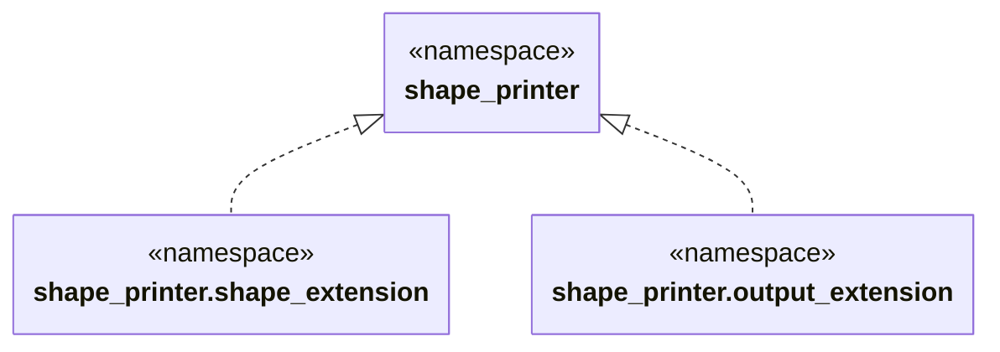

# 7_namespace

## Mission
* Separate source and header files.
* Separate PrintShape core modules and extensions with namespace.

```mermaid
%%{
  init: {
    "class": {
      "hideEmptyMembersBox": "true"
    }
  }
}%%
classDiagram
  class shape_printer {
    <<namespace>>
  }
  class shape_printer.shape_extension {
    <<namespace>>
  }
  class shape_printer.output_extension {
    <<namespace>>
  }
  shape_printer <|.. shape_printer.shape_extension
  shape_printer <|.. shape_printer.output_extension
```
