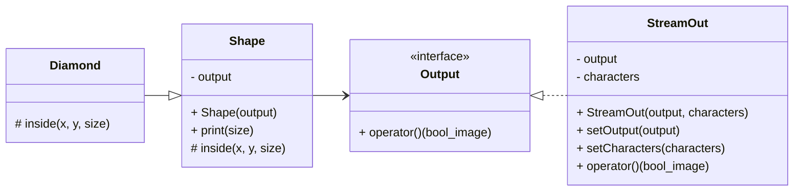

# 12_shape_printer_designed

## Mission
* Complete the implementation from the design.
  - Provide the design as a prompt.
  - Provide the design in header files.

### Bridge Pattern

Here is a prompt that explains the above design. Ask Copilot with the below and you can get nearly complete program.
AI may not be able to perfectly capture all the requirements today, but the future is bright.
Let’s focus on creating better quality designs and delegate the detailed implementation to AI.
```
Create a C++ project called shape-printer.
This program prints a shape with width and height of 2 * rows - 1 for the given rows.
A functor Output which prints a given Boolean image.
The StreamOut class that extends Output prints a given Boolean image using a std::ostream instance
and characters for the inside, outside, and end of line of the shape.
The std::ostream instance and characters can be set in the constructor of the StreamOut class.
The Shape class is a base class that can be extended with Diamond, Cross, Circle, etc.
The Shape class has an Output instance which is set using the constructor.
The Shape class has a print(rows) which creates a Boolean image using inside() and prints it via the Output instance.
The extending classes implement inside(x, y, rows) that returns whether the given (x, y) is inside the shape.
x and y are in the range [-rows+1, rows-1].
```
