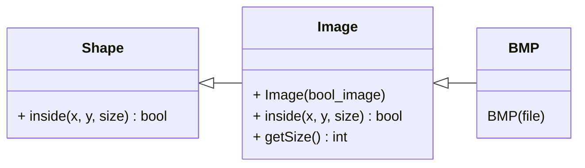

# 10_image_shape

## Mission
* Define Image to extend Shape with Boolean image.
* Define BMP to extend Image.


```c++
int main() {
  BMP bmp("diamond.bmp");
  StreamOut streamOut;
  PrintShape pritnShape(bmp, streamOut);
  printShape(bmp.getSize());

  return 0;
}
```
