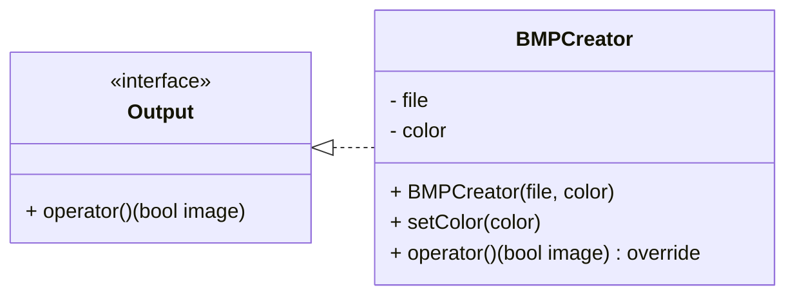

# 9_bmp_creator_functor

## Mission
* Define BMPCreator that implements Output.


```c++
int main() {
  BMPCreator bmpCreator("diamond.bmp");
  bmpCreator.setColor(255, 0, 0);    // red
  PrintShape printShape([](int x, int y, int n) { return std::abs(x) + std::abs(y) < n; }, bmpCreator);
  printShape(10);

  return 0;
}
```
