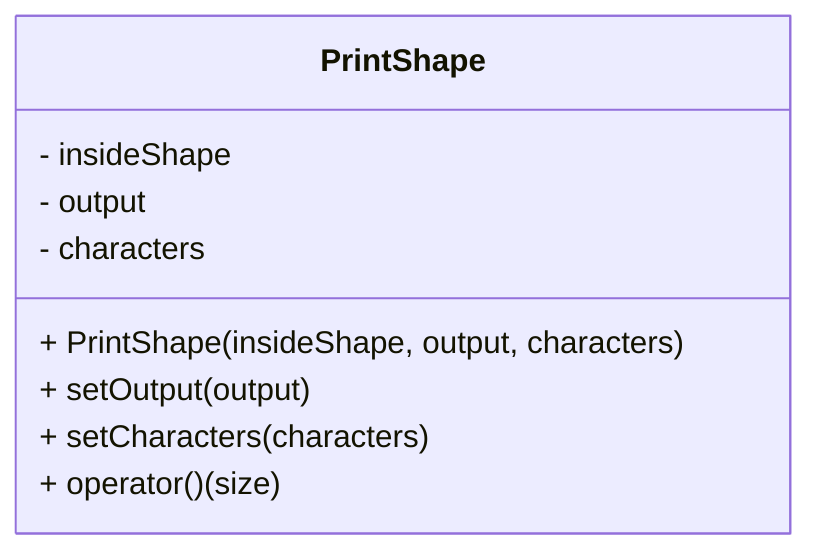

# 4_output_extension

## Mission
* Add setOutput and setCharacters in PrintShape.


```c++
int main() {
    PrintShape printShape([](int x, int y, int n) { return std::abs(x) + std::abs(y) < n; });

    std::ofstream file("diamond.txt");
    printShape.setOutput(file);
    printShape.setCharacters("O", ".");
    printShape(10);

    return 0;
}
```
