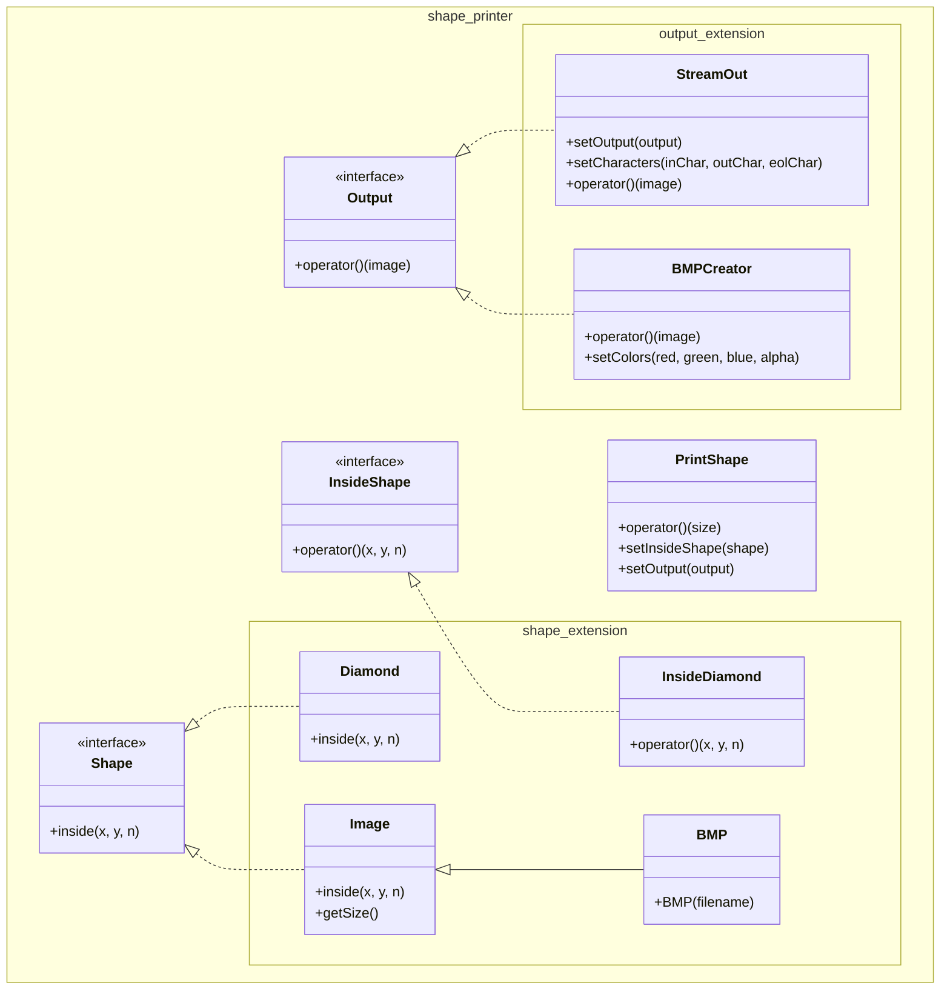

# 🚀 How to Effectively Use AI Tools (GitHub Copilot)

[](LICENSE)
- Developing High-Quality Software Efficiently with AI Tools

## Introduction

The `shape-printer` project showcases modern C++ design patterns and the power of AI-assisted development. By leveraging tools like GitHub Copilot, this project demonstrates how developers can:

- Rapidly prototype and implement extensible software architectures
- Focus on design decisions rather than boilerplate code
- Create more maintainable and testable code through proper separation of concerns
- Develop complex software systems with reduced development time and effort

This collaboration between human design expertise and AI assistance results in higher quality software that follows best practices while minimizing development overhead.

## 🔍 Overview

Shape Printer is a versatile C++ library that renders geometric shapes through various output methods. The project follows a modular, plugin-based architecture where:

- Shapes are defined by their mathematical properties or pixel data
- Output methods are interchangeable and independent of shape definitions
- The core printing logic remains unchanged when adding new shapes or output methods

This design philosophy embodies the Open/Closed Principle: the system is open for extension but closed for modification. When you add a new shape, existing output code continues to work without changes. Similarly, adding a new output method doesn't require modifying any shape definitions.

## 🤖 AI-Powered Development

This project serves as a practical demonstration of how AI tools can revolutionize software development:

### 💡 Why AI Tools Matter

- **Accelerated Development**: AI assistants like GitHub Copilot can generate boilerplate code, suggest implementations, and help with repetitive tasks, allowing developers to focus on higher-level design decisions.
  
- **Knowledge Augmentation**: AI tools can suggest patterns, idioms, and best practices, serving as an always-available pair programming partner with broad knowledge of coding standards.

- **Reduced Cognitive Load**: By handling routine coding tasks, AI tools free up mental bandwidth for solving complex problems and architectural considerations.

- **Learning Acceleration**: Developers can learn new patterns and techniques by examining AI-generated suggestions, accelerating the learning curve for junior developers.

## 📐 Architecture

### Separation of Concerns

Shape Printer demonstrates excellent separation of concerns through its modular architecture:

- **Shape Definition**: The system cleanly separates shape definition (what's inside vs. outside) from rendering logic.
  - `Shape` interface defines a contract for determining points inside shapes
  - `InsideShape` provides a function-like interface for the same purpose
  - Both approaches allow treating shapes as black boxes with a simple inside/outside query

- **Output Handling**: Output formatting and destination are completely decoupled from shape generation.
  - `Output` interface creates a boundary between shape data and presentation
  - Different output implementations can render the same data in various formats

- **Rendering Logic**: The core `PrintShape` class serves as a bridge between shapes and outputs.
  - Transforms shape definitions into concrete 2D boolean arrays
  - Delegates to the output handler without knowing specifics of rendering

This separation ensures that changes in one area won't affect others, making the codebase more maintainable and resilient to change.

### Extensibility for Shapes

The system supports multiple approaches to define shapes, offering flexibility for different use cases:

1. **Lambda Functions**: For quick, one-off shape definitions
   ```cpp
   PrintShape printShape([](int x, int y, int n) { return x*x + y*y < n*n; }, output);
   ```

2. **Free Functions**: For reusable but simple shapes
   ```cpp
   bool insideHexagon(int x, int y, int n) { /* logic */ }
   PrintShape printShape(insideHexagon, output);
   ```

3. **Functors**: For shapes that may need internal state
   ```cpp
   class InsideStarShape : public InsideShape { /* implementation */ };
   PrintShape printShape(InsideStarShape(), output);
   ```

4. **Shape Classes**: For complex shapes with additional methods
   ```cpp
   class RegularPolygon : public Shape { /* implementation */ };
   PrintShape printShape(RegularPolygon(6), output); // hexagon
   ```

5. **Image-Based Shapes**: For irregular or bitmap-defined shapes
   ```cpp
   Image customShape(/* bitmap data */);
   PrintShape printShape(customShape, output);
   ```

Adding a new shape is as simple as implementing one of these approaches with your shape's logic, requiring no changes to the existing system.

### Extensibility for Output Methods

The output system is designed for easy extension through the `Output` interface:

1. **Console Output**: Already implemented via `StreamOut`
   ```cpp
   StreamOut consoleOut(std::cout);
   printShape.setOutput(consoleOut);
   ```

2. **String Output**: Using `StreamOut` with a string stream
   ```cpp
   std::ostringstream oss;
   StreamOut stringOut(oss);
   printShape.setOutput(stringOut);
   ```

3. **File Output**: Using `StreamOut` with a file stream
   ```cpp
   std::ofstream file("shape.txt");
   StreamOut fileOut(file);
   printShape.setOutput(fileOut);
   ```

4. **Image Output**: Using `BMPCreator` for bitmap images
   ```cpp
   BMPCreator bmpOut("shape.bmp");
   printShape.setOutput(bmpOut);
   ```

5. **Custom Output Formats**: Creating new implementations of `Output`
   ```cpp
   class SVGOutput : public Output { /* implementation */ };
   SVGOutput svgOut("shape.svg");
   printShape.setOutput(svgOut);
   ```

This design makes it trivial to add support for new output formats (like HTML, SVG, or JSON) by simply creating a new class that implements the `Output` interface.

### Improved Testability

The modular design facilitates comprehensive testing of individual components:

1. **Shape Testing**: Each shape can be tested in isolation
   ```cpp
   TEST(DiamondTest, InsideDiamondFunction) {
       EXPECT_TRUE(insideDiamond(0, 0, 2));
       EXPECT_FALSE(insideDiamond(2, 0, 2));
   }
   ```

2. **Output Testing**: Output mechanisms can be verified independently
   ```cpp
   TEST(StreamOutTest, CustomCharacters) {
       std::ostringstream oss;
       StreamOut streamOut(oss, "O", ".");
       // Test with a known pattern
   }
   ```

3. **Integration Testing**: The `PrintShape` class can be tested with mock objects
   ```cpp
   TEST(PrintShapeTest, LambdaFunction) {
       // Mock output captures the result
       std::vector<std::vector<bool>> result;
       auto output = [&result](const auto& image) { result = image; };
       PrintShape printShape(insideDiamond, output);
       printShape(2);
       // Verify the result
   }
   ```

4. **Dependency Injection**: The system's use of interfaces enables easy mocking
   ```cpp
   class MockShape : public Shape {
       MOCK_METHOD(bool, inside, (int, int, int), (const, override));
   };
   
   class MockOutput : public Output {
       MOCK_METHOD(void, operator(), (const std::vector<std::vector<bool>>&), (const, override));
   };
   ```

This approach allows for comprehensive test coverage, making it easier to maintain quality as the codebase evolves.

### Class Diagram


## 📝 Getting Started

### Prerequisites

- CMake 3.10+
- C++17 compatible compiler

### Building

```bash
mkdir build
cd build
cmake ..
make
```

### Testing

```bash
cd build
ctest
```

## 🔄 The Human-AI Collaboration

This project demonstrates that the most effective approach is not to rely solely on AI tools, but to establish a productive collaboration:

1. **Human**: Design high-level architecture and interfaces
2. **AI**: Generate implementation details and boilerplate
3. **Human**: Review, refine, and ensure quality
4. **AI**: Assist with tests and documentation
5. **Human**: Make final design decisions and optimizations

Through this collaboration, we achieve both development efficiency and high-quality software design.

## 📜 License

This project is licensed under the Apache License 2.0 - see the [LICENSE](LICENSE) file for details.
