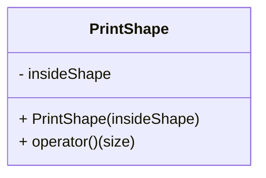

# 3_print_shape_functor

## Mission
* Define PrintShape class to store insideShape function.


```c++
int main() {
    PrintShape printShape([](int x, int y, int n) { return std::abs(x) + std::abs(y) < n; });
    printShape(1);
    printShape(2);

    return 0;
}
```
