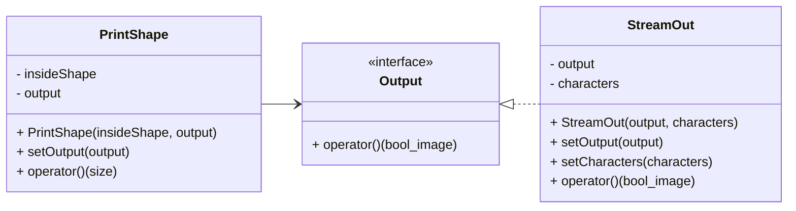

# 6_writing_adr

## Mission
* Write [ADR](https://adr.github.io/) (Architectural Decision Record) for the output extension.

### Design 1

```mermaid
classDiagram
  class PrintShape {
    - insideShape
    - output
    - characters
    + PrintShape(insideShape, output, characters)
    + setOutput(output)
    + setCharacters(characters)
    + operator()(int n)
  }
```

### Design 2

```mermaid
classDiagram
  direction LR
  class PrintShape {
    - insideShape
    - output
    + PrintShape(insideShape, output)
    + setOutput(output)
    + operator()(size)
  }
  class Output {
    <<interface>>
    + operator()(bool_image)
  }
  class StreamOut {
    - output
    - characters
    + StreamOut(output, characters)
    + setOutput(output)
    + setCharacters(characters)
    + operator()(bool_image)
  }
  Output <|.. StreamOut
  PrintShape --> Output

```
