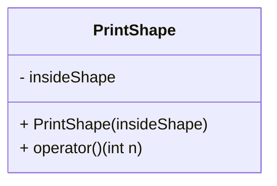

# 3_print_shape_functor

## Mission
* Define PrintShape class to store insideShape function.


```c++
class PrintShape {
    std::function<bool(int, int, int)> insideShape;

public:
    PrintShape(std::function<bool(int, int, int)> insideShape);
    void operator()(int n) const;
};

int main() {
    PrintShape printShape([](int x, int y, int n) { return std::abs(x) + std::abs(y) < n; });
    printShape(1);
    printShape(2);

    return 0;
}
```
