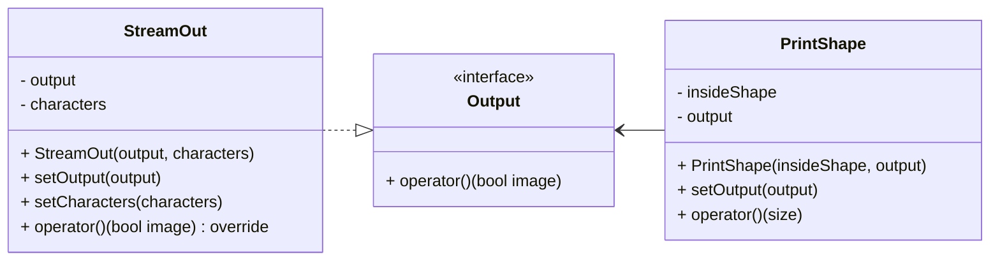

# 5_stream_out_functor

## Mission
* Separate the output method from the PrintShape class.
* Design the output method to be independently extensible.


```c++
int main() {
    StreamOut streamOut;
    std::ofstream file("diamond.txt");
    StreamOut.setOutput(file);
    StreamOut.setCharacters("O", ".");

    PrintShape printShape([](int x, int y, int n) { return std::abs(x) + std::abs(y) < n; }, streamOut);
    printShape(10);

    return 0;
}
```
