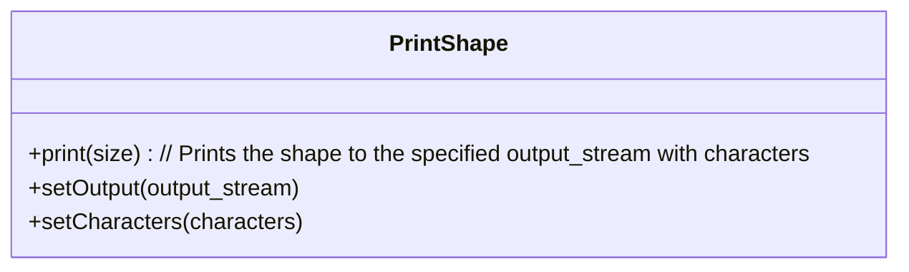
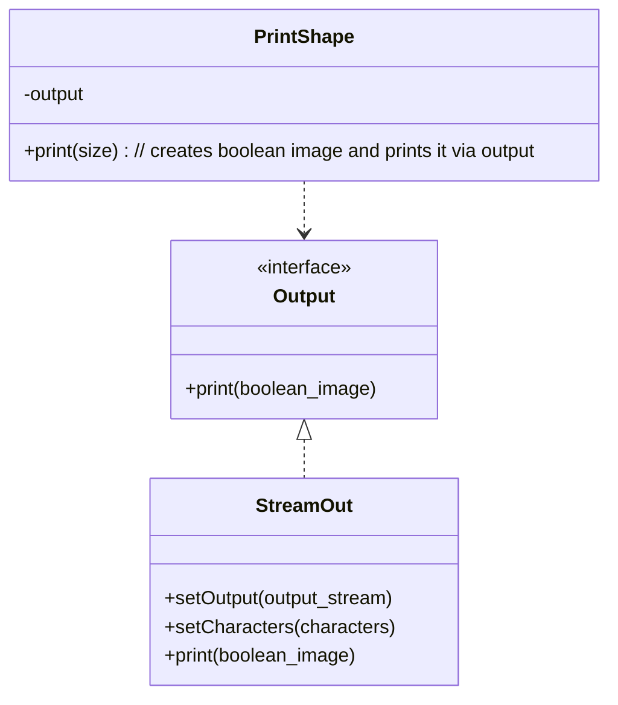

# Extensible Design for the Output Method of `PrintShape`

## Problem Statement

The `PrintShape` function currently supports a limited set of output methods. To enhance its versatility, we need to extend its capabilities to include various output methods such as:

- String printing: Output the shape as a string.
- File printing: Save the shape to a text file.
- BMP file printing: Export the shape as a BMP image file.

By designing the output methods to be easily extendable, future modifications and maintenance will be more straightforward, ensuring that new output methods can be added with minimal changes to the existing codebase.

## Design Candidates

### Candidate 1: `PrintShape` provides `setOutput` and `setCharacters`

In this design, the `PrintShape` class is responsible for setting the output method and the characters used for printing the shape. The class will have the following methods:

- `setOutput(output_stream)`: Sets the output method (e.g., string, file, BMP).
- `setCharacters(characters)`: Sets the characters used to represent the shape.

### Candidate 2: `PrintShape` creates a boolean image and prints it via the `Output` interface

In this design, the `PrintShape` class creates a boolean image of the shape and delegates the printing to an `Output` interface. The `Output` interface will have a method to print the shape, and `StreamOut`, which extends the `Output` interface, will provide methods to set the output method and characters:

- `Output.print(boolean_image)`: Prints the boolean image of the shape.
- `StreamOut.setOutput(output_stream)`: Sets the output method.
- `StreamOut.setCharacters(characters)`: Sets the characters used to represent the shape.

## Pros and Cons

### Candidate 1: `PrintShape` provides `setOutput` and `setCharacters`

#### Pros:
- Simple and straightforward implementation
- Easy to understand for new developers
- Minimal code complexity
- Direct control over output methods

#### Cons:
- Violates the Single Responsibility Principle (SRP) - `PrintShape` is responsible for both shape creation and output handling
- Less flexible for adding new output methods (requires modifying the `PrintShape` class)
- Higher coupling between shape creation and output formatting
- More difficult to test output methods independently
- Not suitable for extensions that output colors rather than characters, such as BMP.

### Candidate 2: `PrintShape` creates a boolean image and prints it via the `Output` interface

#### Pros:
- Follows the Open/Closed Principle - open for extension, closed for modification
- Separation of concerns - shape creation and output handling are separate
- More extensible - new output methods can be added by implementing the `Output` interface
- Easier to test each component independently
- Promotes loose coupling between components

#### Cons:
- More complex initial implementation
- Requires understanding of interfaces and polymorphism
- Slightly higher learning curve for new developers
- May involve more classes and code organization

## Comparison Table

| Aspect | Candidate 1: `PrintShape` provides `setOutput` and `setCharacters` | Candidate 2: `PrintShape` creates a boolean image and prints via `Output` interface |
|--------|-------------------------------------------------------------------|-----------------------------------------------------------------------------------|
| **Architecture** | Monolithic design | Separation of concerns via interfaces |
| **Extensibility** | Limited - requires modifying `PrintShape` | High - new output methods can be added by implementing `Output` interface |
| **Complexity** | Low - straightforward implementation | Medium - requires understanding of interfaces and polymorphism |
| **Testability** | Harder to test output methods independently | Easier to test components independently |
| **SOLID Principles** | Violates Single Responsibility Principle | Follows Open/Closed Principle |
| **Learning Curve** | Easy for new developers | Steeper initial learning curve |
| **Maintenance** | Higher coupling makes changes more difficult | Lower coupling facilitates maintenance |
| **Flexibility** | Limited for non-character outputs (e.g., BMP) | Supports diverse output formats through different implementations |
| **Code Organization** | Fewer classes, centralized logic | More classes, distributed logic |

## Design Outcome

After evaluating the design candidates, **Candidate 2** has been selected as the preferred approach. By having `PrintShape` create a boolean image and delegating the printing responsibility to the `Output` interface, we achieve:

1. Better separation of concerns
2. Higher extensibility for adding new output methods
3. Improved testability of individual components
4. Compliance with SOLID principles, particularly the Open/Closed Principle

This design allows us to easily implement all the required output methods (string printing, file printing, BMP file printing) by creating different implementations of the `Output` interface without modifying the core `PrintShape` logic.

The modular architecture will make it straightforward to add more output formats in the future, such as SVG, HTML, or console output with ANSI colors, by simply creating new implementations of the `Output` interface.